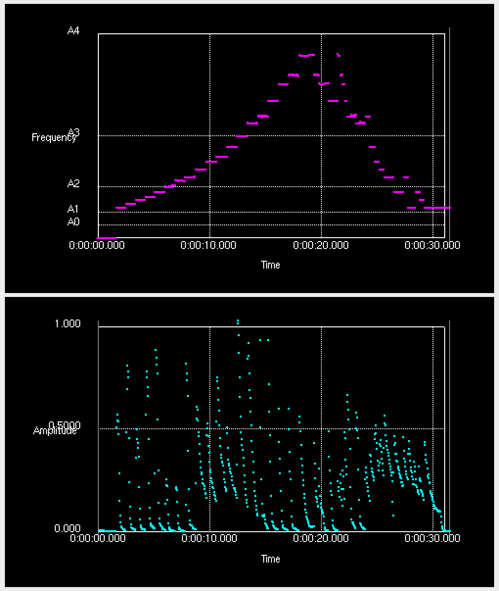
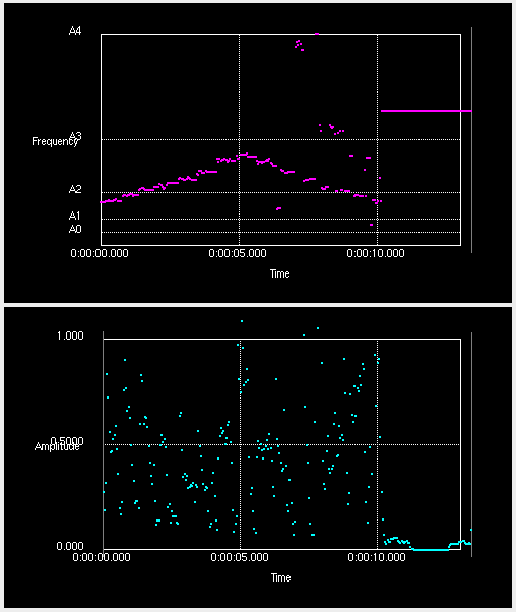
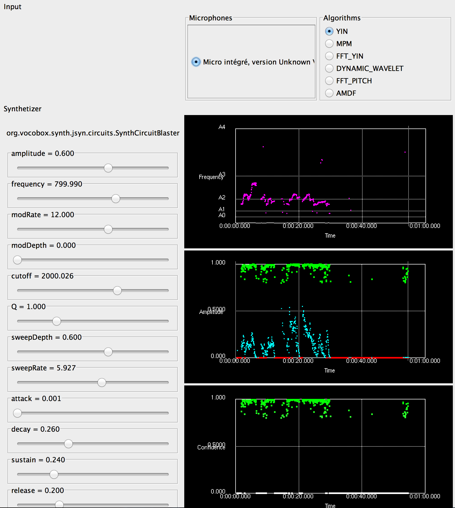

#VOCOBOX

Voice Controller for Digital Instruments

## Description

Vocobox intend to provide singers with a software turning the voice to a musical controller. Voice features (pitch, volume, ...) are used to control external software or hardware producing music.

We rather want to build a voice-to-instrument application than an audio-to-midi application. For this reason we found sufficient to control synthetizer in terms of frequency and amplitude, without clearly defining note on/off events. It makes mapping easier, and result is good enough.

###### VOCOBOX 1.0 (01/01/2015)

At this step we are mainly evaluating pitch detection algorithms using the <a href="https://github.com/vocobox/human-voice-dataset">Human Voice Dataset</a>, a dataset we build to gather examples of singers' voice (e.g. all notes in their range). We define score such as note onset latency, pitch detection latency and <a href="https://github.com/vocobox/vocobox/blob/master/doc/benchmark-human-voice">compare pitch detection performance with charts</a>.

We also evaluate pitch detection <i>in real time</i> by recording the voice with a microphone as input and by generating a synthetizer sound as output.

See the component section of this document to learn more about algorithms used in this project.

To get notified of futured version, simply <a href="https://twitter.com/Vocobox">follow Vocobox</a> on Twitter.

## Applications

Folder vocobox/dev/java/vocobox-apps provides several applications

#### Controlling Synthetizers with CSV files

Our first attempt to analyze voice signal was <a href="https://github.com/vocobox/vocobox/blob/master/dev/r">written in R</a> using <a href="http://rug.mnhn.fr/seewave/">Seewave</a> and <a href="http://aubio.org/">Aubio</a> via an <a href="https://github.com/vocobox/aubio-r/">R binding</a> written for the experiment.

To control JSyn synthetizer, we export frequency and amplitude change commands in <a href="https://github.com/vocobox/vocobox/tree/master/dev/java/vocobox-apps/data/analyses/piano">two CSV files</a>. Each file contains two columns, the first being elapsed time since song started, the second indicating a value change (frequency changes for pitch.csv, and amplitude changes for envelope.csv). Note that frequency and amplitude can change independently.

Having the original wav file available allows to play audio source in background while executing command events.

To run synthetizer control based on a csv files, see <a href="https://github.com/vocobox/vocobox/blob/master/dev/java/vocobox-apps/src/main/java/org/vocobox/apps/csv2synth/VocoboxControllerCsv.java">VocoboxControllerCsv</a>.

#### Controlling Synthetizers with WAV files

The pitch and amplitude change events of a wav file are sent to a <a href="https://github.com/vocobox/vocobox/blob/master/dev/java/vocobox-api/src/main/java/org/vocobox/model/synth/VocoSynth.java">synthetizer</a> via its sendFrequency() / sendAmplitude() methods. In these demonstrations, we use <a href="https://github.com/vocobox/vocobox/tree/master/dev/java/vocobox-synth-jsyn/src/main/java/org/vocobox/synth/jsyn">JSyn based synthetizers</a>. As the direct control of oscillator's amplitude from input file is sufficiently good to mimic notes, we do not need additional computation to define note on and note off.

Below are few synthetized sounds and their wave file controller.

<table>
  <tr>
    <th>Input</th>
    <td><a href="doc/audio/doremi-piano-in.wav">Do-re-mi piano source</a></td>
    <td><a href="doc/audio/doremi-voice-in.wav">Do-re-mi voice source</a></td>
  </tr>
  <tr>
    <th>Output</th>
    <td><a href="doc/audio/doremi-piano-out.wav">Do-re-mi synth controlled by piano</a></td>
    <td><a href="doc/audio/doremi-voice-out.wav">Do-re-mi synth controlled by voice</a></td>
  </tr>
  <tr>
    <th>Chart</th>
    <td></td>
    <td></td>
  </tr>
</table>

See this <a href="http://doc.jzy3d.org/vocobox/examples/">examples</a> folder for more input/output/chart results.

To run synthetizer control based on a wav file, see <a href="https://github.com/vocobox/vocobox/blob/master/dev/java/vocobox-apps/src/main/java/org/vocobox/apps/wav2synth/VocoboxControllerFileRead.java">VocoboxControllerFileRead</a>.


#### Controlling Synthetizers in real time with available audio inputs (microphone,  lines)

When starting the application, the list of available source are listed by tarsos, and an estimation algorithm is proposed. We found Yin performs best. Running live synthetizer control allows to see pitch detection is pretty efficient.



To run synthetizer control based on live voice, see <a href="https://github.com/vocobox/vocobox/blob/master/dev/java/vocobox-apps/src/main/java/org/vocobox/apps/mic2synth/VocoboxControllerMic.java">VocoboxControllerMic</a>

#### Benchmark Pitch Detection algorithm on note datasets

This <a href="https://github.com/vocobox/vocobox/tree/master/doc/benchmark-human-voice">document</a> explain how we use the <a href="https://github.com/vocobox/human-voice-dataset">Human Voice Dataset</a> (a serie of wav files containing human sung notes) to evaluate pitch detection algorithm on isolated notes.

## Components

### Audio analysis

Audio signal analysis is powered by <a href="https://github.com/JorenSix/TarsosDSP">TarsosDSP</a>. Yin implementation outperforms any other algorithm for pitch detection and has become the default implementation for the <a href="">voice analysis module</a>.

Vocobox delivers pitch detection through following analyzers

<table>
<tr>
<th width="220">Analyzer</th>
<th>Comment</th>
</tr>
<tr>
<td>VoiceMicListen</td>
<td>Analyse audio signal from available inputs (microphones, but also lines, etc). <font color="orange">When running a Jack server, audio sources made available by Jack appear in source list!</font>
</td>
</tr>
<tr>
<td>VoiceFileRead</td>
<td>Analyse audio signal from (mono) wav files. After reading, a collection of audio analysis events are collected an can be send to a synthetizer.</td>
</tr>
</table>

### Synthetizers

Synthetizer powered by <a href="https://github.com/philburk/jsyn">JSyn</a> are available in a <a href="https://github.com/vocobox/vocobox/tree/master/dev/java/vocobox-synth-jsyn">dedicated maven module</a>. The below implementations are basic, we can do much more with JSyn!

<table>
<tr>
<th width="220">Synthetizer</th>
<th>Comment</th>
</tr>

<tr>
<td>JsynMonoscilloSynth</td>
<td>A single oscillator.</td>
</tr>

<tr>
<td>JsynMonoscilloRampSynth</td>
<td>A single oscillator having a LinearRamp on frequency and amplitude change commands, handling numerous pitch / amplitude change events without audio artifact.</td>
</tr>

<tr>
<td>JsynOcclusiveNoiseSynth</td>
<td>A synthetizer using a non frequency-defined sound (here : a white noise) when confidence value of pitch detection is below a threshold. It allows a kind of audio debugging of pitch detection. Brutal tone change make the synthetizer sound harsh but smooth changes in tone balance could produce interesting effects.</td>
</tr>

<tr>
<td>JsynCircuitSynth</td>
<td>A synthetizer based on JSyn <a href="http://www.softsynth.com/jsyn/docs/usersguide.php#GroupingUnits">Circuit</a>, allowing easier abstraction of synthetizer element groups. Here, we use circuit SynthCircuitBlaster that is derived from JSyn examples. Note the circuit provides its control panel to Vocobox UI.</td>
</tr>


<tr>
<td>JsynOscilloSpectroHarpSynth</td>
<td>An experimental synthetizer based on FFT analysis of a file. A file is played, its FFT is processed, and all frequency band energies defines amplitude of one the 93 oscillators covering 0-4kHz.</td>
</tr>

</table>


### Charts

Charts are powered by <a href="https://github.com/jzy3d/jzy3d-api">Jzy3d</a>. They are used as synthetizer command logs : parameter changes of the synthetizer are tracked and mapped to multiple 2d charts. Below is the list of available charts. See <a href="http://doc.jzy3d.org/vocobox/vocobox-video.swf">here a video</a> of charts in action.


<table>
  <tr>
    <th width="220">Chart</th>
    <th>Comment</th>
    </tr>
  <tr>
    <td>Frequency chart</td>
    <td>Shows the synthetizer frequency changes with a pink scatter plot. Confidence is used to define alpha, so there is nothing displayed if pitch detection has confidence 0.</td>
  </tr>
  <tr>
    <td>Amplitude chart</td>
    <td>Shows the synthetizer amplitude changes with a cyan scatter plot. Amplitude events below the note relevance threshold (default 0.1) are drawn in gray.</td>
  </tr>
  </table>

Few features interesting with Jzy3d
* easy charting
* performance and liveness
* <font color="orange">coming soon : log chart</font> will help to let frequency charts look like note charts without having to do the frequency-to-note conversion by ourself.
* underlying JOGL let it run everywhere (any Java Windowing toolkit including Android)

## Real time

### Real time Human

<a href="http://aubio.org/phd/thesis/brossier06thesis.pdf">Experiments</a> have shown than human is able to perceive changes up to a limit of 5 to 50 ms (limit depends on sound properties).

### Real time Java?

Standard version of Java can hardly deal with such speed constraints due to non predictability of garbage collection. However there are garbage collectors - such as <a href="http://researcher.watson.ibm.com/researcher/view_group.php?id=174">Metronome GC</a> able work in deterministic time, with promise of not spending more than 3ms in garbage collection

### Perceptual definition of real time

In our works, we simply consider we will reach "real time" once we will <i>feel</i> no cue when triggering a synthetizer by humming.

We did not reach this point yet, but we feel Yin is "close" to real time with little pitch precision error and latency.

## Getting and building source code

Create a Vocobox directory
```
cd dev
mkdir vocobox
cd vocbox
mkdir external
mkdir public
cd public
```


Getting voice dataset
```
git clone https://github.com/vocobox/human-voice-dataset
```

Getting and building vocobox
```
git clone https://github.com/vocobox/vocobox
cd vocobox/dev/java
mvn clean install
```

Maven should retrieve TarsosDSP, JSyn, and Jzy3d from Jzy3d's maven repository.

If you want to build all those components without depending on Jzy3d, you can get our forks enabling JSyn and TarsosDSP on maven:

```
cd ../external/
git clone https://github.com/vocobox/jsyn
git clone https://github.com/vocobox/TarsosDSP tarsosdsp
cd jsyn
mvn clean install -D skipTests
cd ../tarsosdsp
mvn clean install -D skipTests
```

## Contributing
Please join us and share your contributions through <a href="https://help.github.com/articles/using-pull-requests/">pull-requests</a>.

You can contact martin@vocobox.org for questions.

## Licensing
<span style="color:red;">
IF YOU INTEND TO REUSE THIS SOFTWARE, PLEASE VERIFY COMPONENTS LICENCE!
</span>


* <a href="https://github.com/vocobox/vocobox/blob/master/LICENSE">Vocobox</a>
* <a href="http://www.softsynth.com/jsyn/developers/">JSyn</a>
* <a href="https://github.com/JorenSix/TarsosDSP/blob/master/license.txt">Tarsos</a>
* <a href="https://github.com/jzy3d/jzy3d-api/blob/master/jzy3d-api/license.txt">Jzy3d</a>
