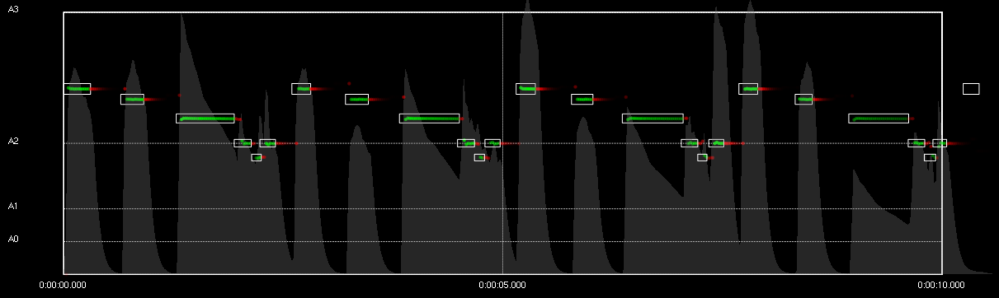
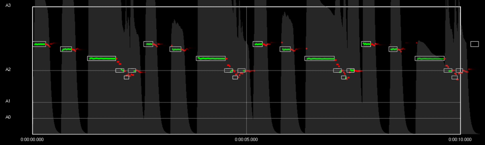
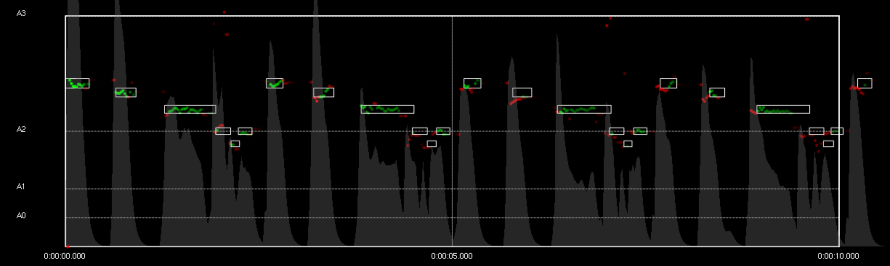
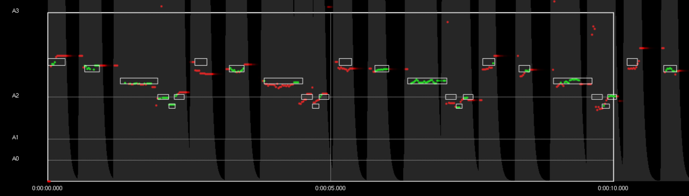
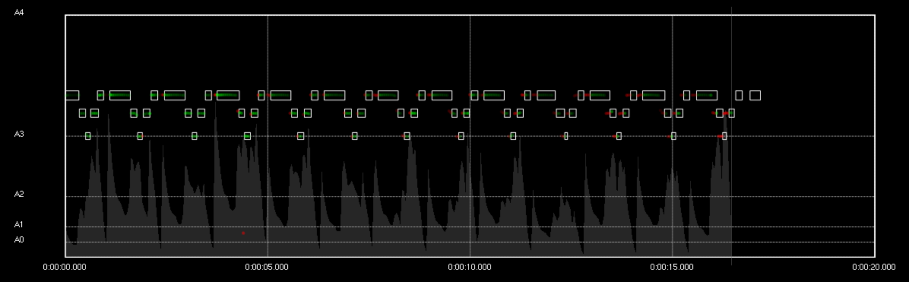
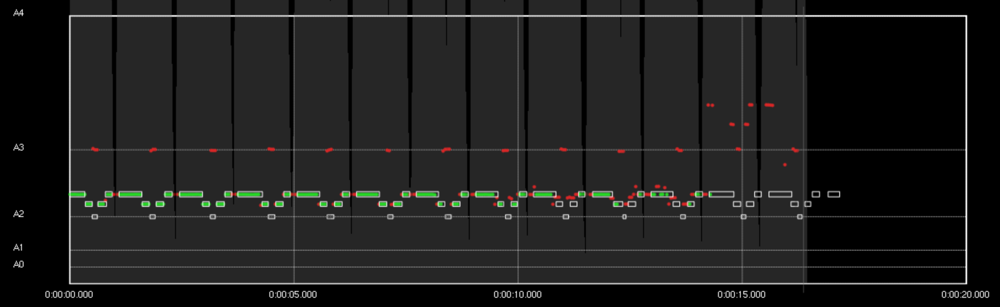
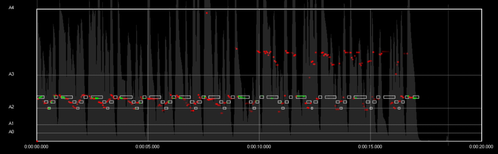

In below charts, expected notes (midi file) are drawn as rectangle.

Pitch detected value is show has a translucent scatter :
* gray when it stand in the frequency range of an expected note, red otherwise.
* alpha according to amplitude.

Amplitude is shown in background. It is scaled to show source enveloppe amplified according synthetizer input gain setting of the simulation.

## SEQUENCE 1

#### Piano (generated from midi file)

We observe errors at note start and end but pitch detection is pretty stable in the middle of each note.

Error at note end is discutable : alpha of the point is defined by amplitude, and there is no clear understanding of WHEN the sound actually stops, so such error should be investigated with audio.

#### Rhode (generated from midi file)

Contrary to previous chart :
* there is latency on note onset, but no wrong pitch detection
* there is real pitch detection error at note offset, whereas pitch detection was still succeeding on piano note release.

#### Voice

#### Voice saturated

## SEQUENCE 2

ON REMARQUE UN DECALAGE / MIDI AUDIO GRANDISSANT AVEC LE TEMPS SUR CETTE SEQUENCE PLUS LONGUE !!

#### Piano (generated from midi file)

Stable

#### Hammond Organ (generated from midi file)

Avec des changements de configuration des harmoniques au cours de la séquence, notamment filtrage "passe haut" qui trompe Yin et lui laisse penser que les notes sont une octave au dessus.

#### Voice

Avec des changements de configuration des harmoniques au cours de la séquence

